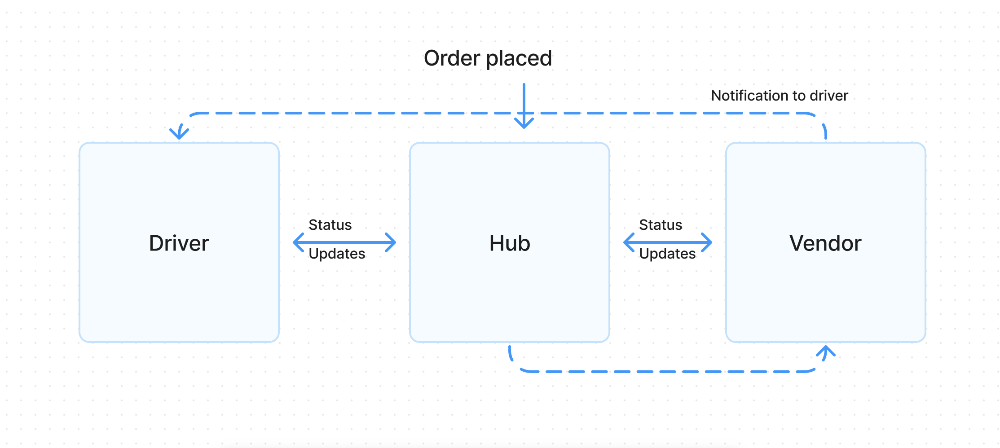

##  LAB - 13
###  CAPS : Message Queues
#### Author:  A. Agabekian

#### Setup

* npm install node
* npm install socket.io
* npm install socket.io-client
* npm install chance

#### Running the app
for best results, start in the order: 
> vendor -> hub -> driver
* node hub/hub.js
* node driver/index.js
* node driver/index.js

_Tests_
* N/A

### UML

